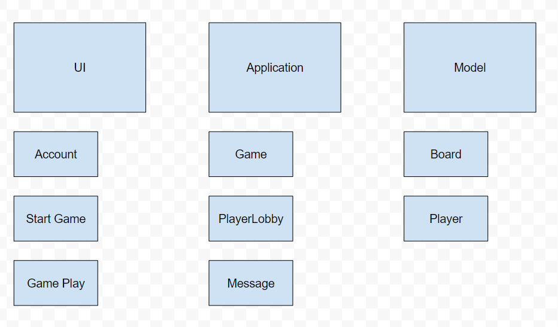
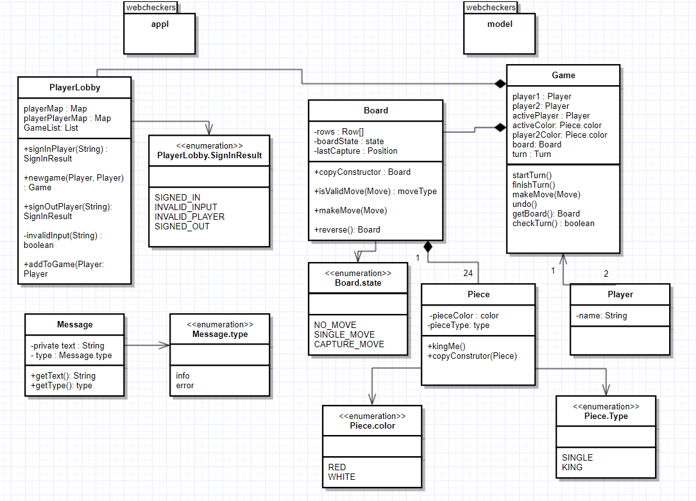
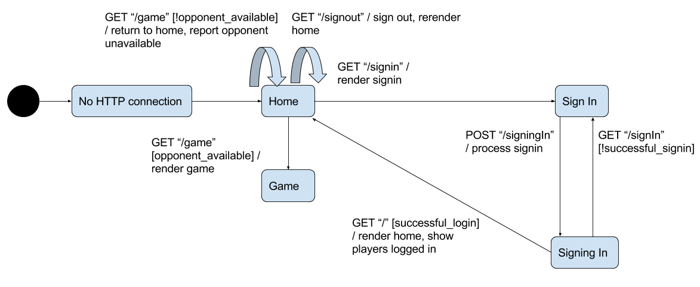

# WebCheckers Design Documentation

> Our Web Checkers Application has been written with many design principles in mind. This documentation is a showcase of how we implemented our design and what principles were used to make those design decisions.

# Team Information
* Team name: Bethesda
* Team members
    * Jonathan Eid
    * Ani Williams
    * Andrew Didycz
    * Disney Ganbaatar

## Executive Summary
The application allows players to play checkers with other players who are currently signed-in.
The game user interface (UI) supports a game experience using drag-and-drop browser capabilities for making moves.

### Purpose
> People who want to play checkers against each other will have that option with our application. 

### Glossary and Acronyms

| Term | Definition             |
| ---- | ---------------------- |
| VO   | Value Object           |
| MVP  | Minimum Viable Product |
| FTL  | Freemarker Template    |
| UI   | User Interface         |

## Requirements

This section describes the features of the application.

Player Sign In: A user may sign in to the server and reserve that name for themselves. They may also sign out.

Start Game: A user, once signed in, may choose to start a game with another user who is also signed in.

Make Move: A player may move one of their pieces on the board and, assuming it's a valid move, that move will change the board.

Undo Move: A player may decide to undo a move within their turn.

Resign Game: A player may choose to quit the game.

Sign in with Password: A player may choose to assign a password to their username.

Asynchronous Games: A player may start a game with another player and play it whenever they want.

### Definition of MVP

Every player must sign-in before playing a game.
Two players must be able to play a game of checkers based upon the American rules.
Either player of a game may choose to resign, which ends the game.

### MVP Features
> As a Player I want to start a game so that I can play checkers with an opponent.

> As a Player I want to sign-in so that I can play a game of checkers.

>As a Player I want to be able to move my pieces forward diagonally so that I can move my pieces 
>closer to the opponent's side of the board and their pieces.

>As a player I want to be able to jump my pieces forward diagonally so that I can move my pieces over the opponent's pieces and remove them from the board.

>As a player I want to be able to jump my piece forward diagonally more than once per turn, as the opportunity presents itself, so that I can move my piece over several of the opponent's pieces in one turn and remove them from the board.

>As a player I want to convert my standard pieces into king pieces whenever they reach the opponent's side of the board so that my pieces have more possible moves.

>As a checkers player I want to undo my move so that I can make a different move.

>As a player in a checkers game, I want to have the option to resign from that game so that I can do something else, like play another game of checkers.

### Enhancements
> A user can sign in with a password to claim and save their name

> Asynchronous games are available to players who want to be able to save their game state so they can sign out and return to it later.

## Application Domain

This section describes the application domain.

### Overview of Major Domain Areas
> Player - The person who wants to sign in to play a game of checkers

> Web Checkers - The website where players go to play checkers

> Board - The game board on which the players play

> Piece - The pieces that the players control

#### Player
> The players are people that want to sign into the Web Checkers website. After signing in, they are able to log out, wait for a player to want to play a game with them, or initialize a game with another player. The players are able to undo their move within their turn as well as resign from the game if they please.

#### Web Checkers
> The web checkers application provides many useful features for its users. It allows them to sign into a waiting room to find or wait for opponents. The application also provides in game features for the players such as undoing a move and resigning from a game. The application also controls the way players have to make moves as players 

#### Board
> The board is an eight by eight square of squares, which are alternatingly black and white. Checkers are initially arranged on both players’ ends of the board, but can only exist and move along the board’s black squares. The board is reversed for the second player’s view. 

#### Piece
> Each piece is either red or white. Pieces that share a color are controlled by the same player. Pieces are placed on the black squares of the board, and can only move on black squares. A normal piece can move one square diagonally toward the other player’s side of the board, or it can jump over an opponent’s piece toward the other player’s side of the board. A piece can be crowned (converted into a king piece) by moving it to the opponent’s edge of the board. King pieces are not restricted in their direction of movement, but are still confined to single and jump moves.

## Architecture

This section describes the application architecture.

### Summary
> The project is split into three architectural tiers. The tiers are: UI (User Interface), Model and Application. The model contains pure java classes that simulate a checkers game being played; the UI tier contains ftl files to display pages to the user and Spark Route classes to handle transitions between pages while the Application tier handles interactions between the two.

> Provide a brief summary of the architecture.  Also provide one or two models (diagrams) that describe the architecture.  Hint: review the Architecture lecture slides for ideas.

### Overview of User Interface
> Provide a summary of the application's user interface.

>The UI tier has a Homepage, a Signin page and a Game page. 
#### Sign In 
#### Home
#### Game

> This includes the UI state model.

### Application
>The Application tier contains a PlayerLobby and a Message class. The tier handles server wide tracking of the users signed in, the games being played and has functionality for signing in players, signing out players, creating games etc.

### Model

>The model is responsible for representing the domain of a checkers game. This tier contains a class for the player, which is responsible for associating a name with a Player object. The model’s board, row, square, piece, move, and position classes store and manipulate the internal representation of the play area. It also contains the game class, which is responsible for associating two players with a board object and maintaining that board. Additionally, it tracks which player is taking their turn and what color their pieces are. The turn class validates and stores moves made during a player’s turn.

## Controller Subsystems
> A sub-system would exist within one of the application tiers and is a group of components cooperating on a significant purpose within the application.  For example, in WebCheckers all of the UI Controller components for the Game view would be its own sub-system. We have the PlayerLobby class that controls what is displayed on the homepage and controls signing in a player. The GameCenter class controls which games are displayed on the home page and controls whether a game is in session or not

## Game Subsystem
> A sub-system would exist within one of the application tiers and is a group of components cooperating on a significant purpose within the application.  For example, in WebCheckers all of the UI Controller components for the Game view would be its own sub-system.

The game class stores two players, the colors assigned to those players, and a board, as well as information pertaining to the turn. Games are created by the GetStartGameRoute, and interact with board and turn objects to continuously progress the state of the game.

### Purpose of the sub-system
> When a game is created, it initializes a board on which the two players can play and assigns a color to each player. The game is then responsible for starting and ending players’ turns, as well as updating the state of the board after each turn ends. Finally, the game is also responsible for checking the state of the board and determining if the game is over. 

### Static models

### Dynamic models
####Turn State Diagram

####Application State Diagram

####Move Validation State Diagram
 
####Asynchronous Sequence Diagram

