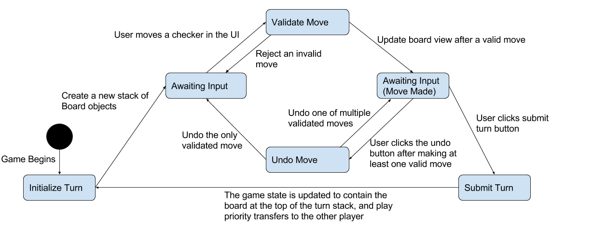

# WebCheckers Design Documentation

> Our Web Checkers Application has been written with many design principles in mind. This documentation is a showcase of how we implemented our design and what principles were used to make those design decisions.

# Team Information
* Team name: Bethesda
* Team members
    * Jonathan Eid
    * Ani Williams
    * Andrew Didycz
    * Disney Ganbaatar

## Executive Summary
The application allows players to play checkers with other players who are currently signed-in.
The game user interface (UI) supports a game experience using drag-and-drop browser capabilities for making moves.

### Purpose
> People who want to play checkers against each other will have that option with our application. 

### Glossary and Acronyms

| Term | Definition             |
| ---- | ---------------------- |
| VO   | Value Object           |
| MVP  | Minimum Viable Product |
| FTL  | Freemarker Template    |
| UI   | User Interface         |

## Requirements

This section describes the features of the application.

Player Sign In: A user may sign in to the server and reserve that name for themselves. They may also sign out.

Start Game: A user, once signed in, may choose to start a game with another user who is also signed in.

Make Move: A player may move one of their pieces on the board and, assuming it's a valid move, that move will change the board.

Undo Move: A player may decide to undo a move within their turn.

Resign Game: A player may choose to quit the game.

Sign in with Password: A player may choose to assign a password to their username.

Asynchronous Games: A player may start a game with another player and play it whenever they want.

### Definition of MVP

Every player must sign-in before playing a game.
Two players must be able to play a game of checkers based upon the American rules.
Either player of a game may choose to resign, which ends the game.

### MVP Features
> As a Player I want to start a game so that I can play checkers with an opponent.

> As a Player I want to sign-in so that I can play a game of checkers.

>As a Player I want to be able to move my pieces forward diagonally so that I can move my pieces 
>closer to the opponent's side of the board and their pieces.

>As a player I want to be able to jump my pieces forward diagonally so that I can move my pieces over the opponent's pieces and remove them from the board.

>As a player I want to be able to jump my piece forward diagonally more than once per turn, as the opportunity presents itself, so that I can move my piece over several of the opponent's pieces in one turn and remove them from the board.

>As a player I want to convert my standard pieces into king pieces whenever they reach the opponent's side of the board so that my pieces have more possible moves.

>As a checkers player I want to undo my move so that I can make a different move.

>As a player in a checkers game, I want to have the option to resign from that game so that I can do something else, like play another game of checkers.

### Enhancements
> A user can sign in with a password to claim and save their name

> Asynchronous games are available to players who want to be able to save their game state so they can sign out and return to it later.

## Application Domain

This section describes the application domain.

### Overview of Major Domain Areas
> Player - The person who wants to sign in to play a game of checkers

> Web Checkers - The website where players go to play checkers

> Board - The game board on which the players play

> Piece - The pieces that the players control

#### Player
> The players are people that want to sign into the Web Checkers website. After signing in, they are able to log out, wait for a player to want to play a game with them, or initialize a game with another player. The players are able to undo their move within their turn as well as resign from the game if they please.

#### Web Checkers
> The web checkers application provides many useful features for its users. It allows them to sign into a waiting room to find or wait for opponents. The application also provides in game features for the players such as undoing a move and resigning from a game. The application also controls the way players have to make moves as players 

#### Board
> The board is an eight by eight square of squares, which are alternatingly black and white. Checkers are initially arranged on both players’ ends of the board, but can only exist and move along the board’s black squares. The board is reversed for the second player’s view. 

#### Piece
> Each piece is either red or white. Pieces that share a color are controlled by the same player. Pieces are placed on the black squares of the board, and can only move on black squares. A normal piece can move one square diagonally toward the other player’s side of the board, or it can jump over an opponent’s piece toward the other player’s side of the board. A piece can be crowned (converted into a king piece) by moving it to the opponent’s edge of the board. King pieces are not restricted in their direction of movement, but are still confined to single and jump moves.

## Architecture

This section describes the application architecture.

### Summary
> The project is split into three architectural tiers. The tiers are: UI (User Interface), Model and Application. The model contains pure java classes that simulate a checkers game being played; the UI tier contains ftl files to display pages to the user and Spark Route classes to handle transitions between pages while the Application tier handles interactions between the two.

> Provide a brief summary of the architecture.  Also provide one or two models (diagrams) that describe the architecture.  Hint: review the Architecture lecture slides for ideas.

### Overview of User Interface
> Provide a summary of the application's user interface.

>The UI tier has a Homepage, a Signin page and a Game page. 
#### Sign In 
#### Home
#### Game

> This includes the UI state model.

### Application
>The Application tier contains a PlayerLobby and a Message class. The tier handles server wide tracking of the users signed in, the games being played and has functionality for signing in players, signing out players, creating games etc.

### Model

>The model is responsible for representing the domain of a checkers game. This tier contains a class for the player, which is responsible for associating a name with a Player object. The model’s board, row, square, piece, move, and position classes store and manipulate the internal representation of the play area. It also contains the game class, which is responsible for associating two players with a board object and maintaining that board. Additionally, it tracks which player is taking their turn and what color their pieces are. The turn class validates and stores moves made during a player’s turn.

## Controller Subsystems
> A sub-system would exist within one of the application tiers and is a group of components cooperating on a significant purpose within the application.  For example, in WebCheckers all of the UI Controller components for the Game view would be its own sub-system. We have the PlayerLobby class that controls what is displayed on the homepage and controls signing in a player. The GameCenter class controls which games are displayed on the home page and controls whether a game is in session or not

## Game Subsystem
> A sub-system would exist within one of the application tiers and is a group of components cooperating on a significant purpose within the application.  For example, in WebCheckers all of the UI Controller components for the Game view would be its own sub-system.

The game class stores two players, the colors assigned to those players, and a board, as well as information pertaining to the turn. Games are created by the GetStartGameRoute, and interact with board and turn objects to continuously progress the state of the game.

### Purpose of the sub-system
> When a game is created, it initializes a board on which the two players can play and assigns a color to each player. The game is then responsible for starting and ending players’ turns, as well as updating the state of the board after each turn ends. Finally, the game is also responsible for checking the state of the board and determining if the game is over. 

### Static models

### Dynamic models
####Turn State Diagram

The turn statechart awaits for the input of a player and to then validate the move if the input was a move or react to the button inputs to initiate an undo, resign, or submit turn.

####Application State Diagram

The application state diagram is initiated when a player connects to the web checkers server. When the user calls different pages, the route classes reroute the user to those pages.

####Move Validation State Diagram

 

The validate move state chart only involves invalid moves that cause no move, valid moves that make single moves, and valid moves that capture pieces. Since only one move can be made, a capture move can't be made after a single. 

####Asynchronous Sequence Diagram

The Asynchronous sequence just demonstrates how an asynchronous game may be played and shows how logging out and in and going to the home screen still causes the game to keep it's state to be played later regardless if who is viewing the game or not.

####Permanent Account Diagram

The permanent account sequence diagram is initiated by the user when they input their username with a given password in the UI components that inform the PlayerLobby controller to identify or validate a password with that username.

##Code Metrics

After completing the MVP and enhancement features for our web checkers project in sprint 3, we used the MetricsReloaded IntelliJ plugin to assess the complexity of our project’s code. Several of the methods and classes used in the web checkers code fell outside the target range for code complexity. As such, these areas would likely benefit from redesign or reimplementation. Below are some of the problematic areas and possible avenues for improvement.

###Complexity Metrics
Board - the board class was by far the most egregious offender in the entire project. Likewise, the checkGameOver method was the most egregious of the board class, having an egregious 84 cyclomatic complexity which was an order or magnitude larger than the average. Another relatively complex method, isValidMove, had a cyclomatic complexity of 43. The makeMove method was a less extreme case, but its value of 4 still exceeded the threshold value for essential cyclomatic complexity established by MetricsReloaded.  Even the constructors for Board were notable for their irregularly high complexity, with design and cyclomatic complexity scores of 14.

The checkGameOver method is the highest priority for refactoring. It is excessively monolithic and has sections that are very repetitive. To change this, we could code a boolean helper method that checks if a piece can make any move or not and have the method call the helper with every piece on the board that is of the their color. Beyond that, we could have an enum that stores the X direction {LEFT, RIGHT} and an enum for the Y direction {FORWARD, BACKWARD}. We could also have an enum for moveType {SINGLE, CAPTURE} where the helper method iteratively tries to validate moves over every possible combination of those three enums and returns true when the first valid move is checked. This would not necessarily speed up the computation but it would make the code a lot more readable and maintainable.

GetStartGameRoute, GetHomeRoute, PostSignInRoute - the handle methods of these three classes were all in violation of the acceptable complexity range. GetStartGameRoute.handle had an essential cyclomatic complexity of 6, while the other offending handle methods had essential cyclomatic complexity values of 4.

Position - this class generally did well in terms of complexity, with the sole exception of the equals method. The equals method has an essential cyclomatic complexity of 4, which exceeds the essential cyclomatic complexity threshold in spite of being in line with other complexity ratings in the project.

There are no necessary changes we can prescribe for this class. Although the equals class was flagged as a complexity offender, the method itself is very simple to read and understand. As for functional implementation, there isn’t much latitude available for variation when writing effective equals methods.

###JavaDoc Metrics

All of the methods that needed Javadocs had them. Fields on the other hand were rarely given javadocs since the team figured that having good code communication (i.e. good variable names) would suffice. Additionally, none of the getters and setters have javadocs.

Although most methods were given Javadocs, the Javadocs written were sometimes incomplete or uninformative. These Javadocs should have more thorough descriptions of how the method works, as well as clearly stating what parameter and return values are expected. This is a particularly important aspect of writing comprehensible code because these preconditions and postcondition act as the contract in the “design by contract” structure.

###Lines of Code Metrics
Out of 3316 total lines of Java code in our project, 2433 lines were functional code and 883 were lines of comments. The model and UI tiers have a somewhat equal split of 1,430 lines and 1,335 lines, respectively, with another 394 lines belonging to the application tier.

Once the aforementioned changes to the Board class are implemented, the number of lines of code in our project should diminish noticeably. The chackGameOver method alone is over 200 lines long, which can be reduced considerably. A large portion of that method consists of nearly identical repeated code segments, which is typically conducive to shortening.

###Chidamber-Kemerer Metrics

Our Coupling was fairly low for most classes with the exception of the PlayerLobby and GameCenter, but that makes sense since they are GRASP controller classes. Additionally the Board and GetGameRoute had bad coupling. In terms of weighted method complexity, Board was once again identified as a complexity outlier. Its score of 131 was more than triple the next most complex class, Game, which was rated 29.

As mentioned in the Lines of Code section, the Board class has a great deal of room for improvement. See the Complexity Metrics section for a more detailed improvement plan.

###Martin Packaging Metrics

The model tier had the highest afferent coupling while the UI tier had the highest efferent couplings. The UI also had the worst instability. The application had the greatest distance from the main sequence. The abstractness was 0 for all packages.

No changes are prescribed for the UI tier and its high efferent coupling. Because the UI tends to depend on a large number of classes in both the UI and model tiers, it is to be expected that its efferent coupling will be higher than that of other packages. However, the afferent coupling of the model tier should be diminished by distributing responsibilities more evenly between model tier classes. Board could transfer some of its functionality to the row and square classes, while game could transfer some of its duties to the board and player classes.

## Design Comments

Our front end design is pretty good. All of the spark and Ajax routes do what they need to following the design principles. We followed information hiding and information expert throughout the project, by assigning data and functionality to the proper classes. We had multiple violations of the Law of Demeter, but that was because we were rushing and that accrued a lot of technical debt in some places. We did not do any sort of inheritance in our project (beyond the spark routes) but that was because we never needed to.

We observed the single responsibility principle very closely and had very high cohesion. Our coupling left something to be desired. Board and Game had too many dependencies and the UI had a lot of efferent coupling. 

We improved our design from sprint to sprint according to the feedback we received. This meant we spent a lot of time refactoring code. This was annoying because we wanted to spend time actually developing but it was worth it as having a good foundation really helped keep everyone on track.

We used a lot of dependency injection to help with unit tests, although we never wrote unit tests so whatever. 

We used the controller principle in the PlayerLobby and GameCenter classes. 

Our BoardMaker class had a set of hardcoded boards that easily allowed us to show off certain features and cases. 

Our main issue was the Board class. We seriously need to refactor the checkGameOver() and isValidMove() methods since they were just monolithic spaghetti code. Refer to the code metrics portion for our plans on improving. 